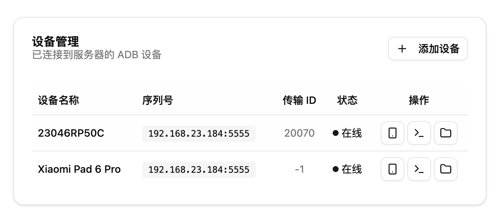
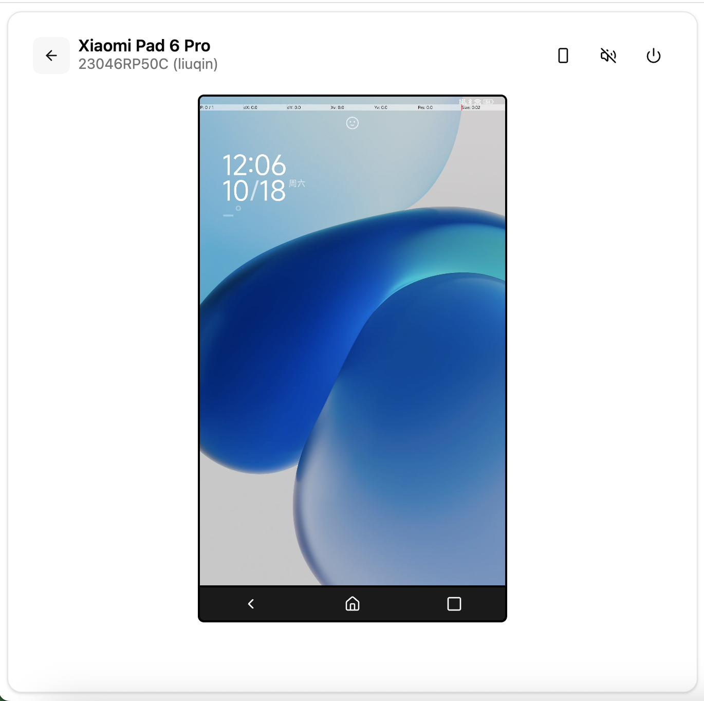

# AMC - Android Management & Control

<div align="center">

**🚀 Web-based Android Device Management and Screen Mirroring Solution**

[](LICENSE)
[](https://nodejs.org/)
[](https://www.typescriptlang.org/)

[Features](#-features) • [Demo](#-demo) • [Installation](#-installation) • [Usage](#-usage) • [Tech Stack](#-tech-stack) • [Contributing](#-contributing)

</div>

---

## ✨ Features

### 📱 Core Capabilities
- **Real-time Screen Mirroring** - High-performance screen streaming powered by scrcpy
- **Remote Control** - Full touch, keyboard, and gesture support
- **Audio Streaming** - Real-time audio playback (Opus codec)
- **Multi-device Management** - Connect and manage multiple Android devices simultaneously
- **Direct TCP Connection** - Connect to devices via IP:PORT without installing ADB (Recommended) ⭐

### 🎯 Advanced Features
- **Mobile-Optimized** - Automatic landscape rotation and touch coordinate transformation for mobile browsers
- **Device Auto-Discovery** - Real-time device detection and status updates via WebSocket
- **Persistent Storage** - SQLite database for device information and history
- **Device Information** - Comprehensive device details (model, Android version, network info, battery status, etc.)
- **Quick Connect** - Add devices by IP address directly from the UI

### 💡 User Experience
- **Modern UI** - Beautiful interface built with shadcn/ui and TailwindCSS
- **Responsive Design** - Works seamlessly on desktop and mobile devices
- **HTTPS Support** - Secure connections with auto-generated SSL certificates
- **Real-time Updates** - Live device status and connection state

---

## 📸 Screenshots

<div align="center">

**Desktop View - Device List**



**Desktop View - Screen Mirroring**



</div>

---

## 📋 Prerequisites

- **Node.js** >= 18
- **OpenSSL** (for certificate generation)
- **ADB** (Android Debug Bridge) - **Optional**, only needed for USB connections

> 💡 **Note**: ADB is optional! You can connect to devices directly via TCP by entering `IP:PORT` in the web interface.

### Install ADB (Optional)

**macOS:**
```bash
brew install android-platform-tools
```

**Linux:**
```bash
sudo apt-get install adb
```

**Windows:**

Download from [Android SDK Platform Tools](https://developer.android.com/tools/releases/platform-tools)

---

## 🛠️ Installation

```bash
# 1. Clone the repository
git clone https://github.com/o2e/android_master_scrcpy.git
cd android_master_scrcpy

# 2. Install dependencies (auto-generates SSL certificates)
npm install

# 3. Generate and push database schema
npm run db:push

# 4. (Optional) Seed database with sample data
npm run db:seed
```

---

## 🚀 Usage

### Development Mode

```bash
# Terminal 1: Start backend server (http://localhost:8080)
npm run server:dev

# Terminal 2: Start frontend dev server (https://localhost:5173)
npm run dev
```

**Access the application:**
- Frontend: `https://localhost:5173`
- Backend API: `http://localhost:8080`

### Production Build

```bash
npm run build
npm run server:start
```

---

## 📱 Connecting Android Devices

### Method 1: Direct TCP Connection (Recommended) ⭐

**No ADB installation required!**

1. Enable **Wireless Debugging** on Android device
   - Go to **Settings** → **Developer Options** → **Wireless Debugging** → Enable
   - Tap **Wireless Debugging** to see the IP:PORT
2. Click "**添加设备**" (Add Device) button in the web UI
3. Enter the device address (e.g., `192.168.1.100:5555`)
4. Accept authorization prompt on Android device
5. Start controlling!

### Method 2: ADB Server Connection

**Prerequisites:** ADB must be installed

**Via USB:**
1. Enable **USB Debugging** on your Android device
2. Connect device via USB
3. Accept ADB authorization prompt
4. Device appears automatically in the web interface

**Via WiFi:**
```bash
# Step 1: Connect device via USB first
adb tcpip 5555

# Step 2: Find device IP address (Android Settings → About Phone → Status)
# Or use: adb shell ip addr show wlan0

# Step 3: Connect to device
adb connect 192.168.1.100:5555

# Step 4: Device will appear in the web interface
```

---

## 📦 Available Scripts

### Development
```bash
npm run dev              # Start Vite dev server with HTTPS
npm run server:dev       # Start backend server with watch mode
npm run server:start     # Start backend server (production)
```

### Build
```bash
npm run build            # Build frontend for production
```

### Database
```bash
npm run db:push          # Push Prisma schema to database
npm run db:generate      # Generate Prisma client
npm run db:studio        # Open Prisma Studio (database GUI)
npm run db:seed          # Seed database with sample data
```

### Certificates
```bash
npm run cert:generate    # Generate self-signed SSL certificates
```

---

## 🏗️ Tech Stack

### Frontend
| Technology | Version | Description |
|------------|---------|-------------|
| [React](https://react.dev/) | 19 | UI framework |
| [TypeScript](https://www.typescriptlang.org/) | 5+ | Type safety |
| [Vite](https://vitejs.dev/) | 6+ | Build tool |
| [TailwindCSS](https://tailwindcss.com/) | 4+ | Styling |
| [shadcn/ui](https://ui.shadcn.com/) | - | UI components |
| [React Router](https://reactrouter.com/) | 7+ | Routing |
| [ya-webadb](https://github.com/yume-chan/ya-webadb) | Latest | ADB over WebSocket |

### Backend
| Technology | Version | Description |
|------------|---------|-------------|
| [Fastify](https://fastify.dev/) | 11+ | Web framework |
| [Prisma](https://www.prisma.io/) | 6+ | ORM |
| [SQLite](https://www.sqlite.org/) | - | Database |
| [ws](https://github.com/websockets/ws) | - | WebSocket |
| [scrcpy](https://github.com/Genymobile/scrcpy) | 3.3.3 | Screen mirroring |

---

## 📁 Project Structure

```
android_master_scrcpy/
├── src/
│   ├── components/           # React components
│   │   └── ui/              # shadcn/ui components
│   ├── scrcpy/              # Screen mirroring components
│   │   ├── DeviceDetail.tsx # Main control interface
│   │   ├── TouchControl.tsx # Touch input handling
│   │   ├── AudioManager.ts  # Audio streaming
│   │   └── KeyboardControl.tsx
│   ├── server/              # Backend server
│   │   ├── routes/          # API routes
│   │   │   ├── adb.routes.ts    # ADB device management
│   │   │   └── device.routes.ts # Device registration
│   │   ├── transport/       # WebSocket & ADB transport
│   │   ├── config.ts        # Server configuration
│   │   └── index.ts         # Server entry point
│   ├── lib/                 # Utilities
│   │   ├── device-detect.ts # Mobile device detection
│   │   └── utils.ts         # Helper functions
│   ├── types/               # TypeScript type definitions
│   └── App.tsx              # Main app component
├── prisma/
│   ├── schema.prisma        # Database schema
│   └── seed.ts              # Database seeding
├── certs/                   # SSL certificates (auto-generated)
├── scripts/
│   └── generate-cert.js     # Certificate generation script
└── wadbd-4.7/              # Android ADB daemon module
```

---

## 🔧 Configuration

### Environment Variables

Copy `.env.example` to `.env` when you need local overrides:

```env
# Database
DATABASE_URL="file:./dev.db"

# Dev proxy target for Vite
VITE_API_PROXY_TARGET="https://127.0.0.1:8080"

# Server
SERVER_PORT=8080
LOG_LEVEL=info

# Production secrets
COOKIE_SECRET="replace-me"
SESSION_TOKEN="replace-me"
```

### Server Configuration

Edit `src/server/config.ts` to customize:
- ADB server host/port
- WebSocket settings
- Server port and logging

---

## 🎨 Key Features Explained

### Mobile Landscape Adaptation

When using a mobile device to control an Android device in landscape mode:
- **Video automatically rotates 90°** to fit vertical screen
- **Touch coordinates are transformed** to match the rotated display
- Users hold their phone vertically while controlling landscape apps

### Device Information Collection

Automatically collects and stores:
- Hardware: Model, manufacturer, CPU, memory, storage
- Software: Android version, kernel version, security patch
- Network: IP address, interface name
- Battery: Level, status, temperature
- Screen: Resolution, density, orientation
- ADB: Port, status, PID

### Real-time Updates

- **WebSocket connection** for instant device status updates
- **Automatic reconnection** on connection loss
- **Live device discovery** without page refresh

---

## 🔐 HTTPS Setup

The project automatically generates self-signed SSL certificates during installation.

### Trust the Certificate

**macOS:**
```bash
sudo security add-trusted-cert -d -r trustRoot -k /Library/Keychains/System.keychain certs/localhost.crt
```

**Windows:**
```bash
certutil -addstore -f "ROOT" certs/localhost.crt
```

**Linux:**
```bash
sudo cp certs/localhost.crt /usr/local/share/ca-certificates/
sudo update-ca-certificates
```

Or manually trust the certificate in your browser when prompted.

---

## 🐛 Troubleshooting

### Certificate Issues

If you see SSL warnings:
1. Regenerate certificates: `npm run cert:generate`
2. Trust the certificate (see [HTTPS Setup](#-https-setup))
3. Restart your browser

### ADB Connection Failed

```bash
# Check ADB server status
adb devices

# Restart ADB server
adb kill-server
adb start-server

# Check device connection
adb shell echo "Connected"
```

### Port Already in Use

**Frontend port (5173):**
Edit `vite.config.ts`:
```typescript
server: {
  port: 5174,  // Change port
  https: { /* ... */ }
}
```

**Backend port (8080):**
Edit `src/server/config.ts`:
```typescript
export const config = {
  server: {
    port: 8081  // Change port
  }
}
```

### Device Not Appearing

1. **Check USB debugging** is enabled
2. **Verify ADB connection**: `adb devices`
3. **Check WebSocket connection** in browser console
4. **Restart both frontend and backend** servers

---

## 🤝 Contributing

Contributions are welcome! Please feel free to submit a Pull Request.

### Development Setup

1. Fork the repository
2. Create your feature branch: `git checkout -b feature/amazing-feature`
3. Commit your changes: `git commit -m 'Add amazing feature'`
4. Push to the branch: `git push origin feature/amazing-feature`
5. Open a Pull Request

### Code Style

- **Frontend**: Follow React best practices, use TypeScript strictly
- **Backend**: Use Fastify patterns, proper error handling
- **Formatting**: Prettier (runs on pre-commit)
- **Linting**: ESLint (must pass before commit)

---

## 📄 License

This project is licensed under the GNU GPL v3.0 - see the [LICENSE](LICENSE) file for details.

---

## 🙏 Acknowledgments

- [scrcpy](https://github.com/Genymobile/scrcpy) - The amazing screen mirroring solution
- [ya-webadb](https://github.com/yume-chan/ya-webadb) - ADB implementation in TypeScript
- [shadcn/ui](https://ui.shadcn.com/) - Beautiful UI components
- [Fastify](https://fastify.dev/) - Fast and low overhead web framework

---

## 📚 Documentation

- [ya-webadb Documentation](https://tangoadb.dev/)
- [scrcpy Documentation](https://github.com/Genymobile/scrcpy)
- [Fastify Documentation](https://fastify.dev/docs/)
- [Prisma Documentation](https://www.prisma.io/docs/)

---

## 🔗 Links

- **Repository**: https://github.com/o2e/android_manager_scrcpy
- **Issues**: https://github.com/o2e/android_manager_scrcpy/issues
- **Pull Requests**: https://github.com/o2e/android_manager_scrcpy/pulls

---

## 📊 Project Status

This project is actively maintained and open for contributions.

### Roadmap

- [ ] User authentication and login system
- [ ] Multi-user support with permissions
- [ ] Device grouping and tagging
- [ ] Screen recording
- [ ] File transfer
- [ ] Bulk operations
- [ ] Docker support
- [ ] Cloud deployment guide

---

<div align="center">

**If you find this project helpful, please consider giving it a ⭐️**

Made with ❤️ by the community

</div>
